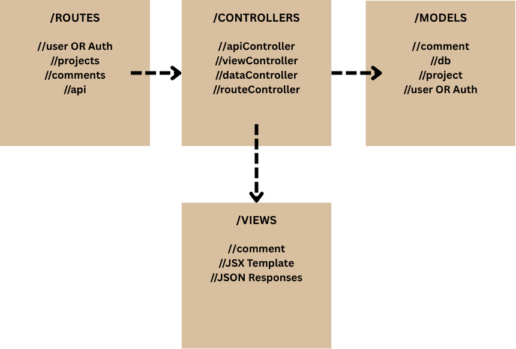

# Architectural Projects Network 📐👷🏻‍♀️

📚 Project Overview
This project is a collaborative platform for architects to download and share their projects with the community. Built with Express.js and MongoDB following the Model-View-Controller (MVC) architecture pattern, the website enables architects to showcase their work, download projects from other professionals, and engage through an interactive comment system. The application includes both web views and API endpoints, with JWT authentication supporting both query parameters (for web views) and headers (for API calls).

## 📖 Complete Documentation Suite
This repository includes comprehensive documentation for learning and implementation:

| **🏗️ MVC_ARCHITECTURE.md** | Complete MVC pattern breakdown | Understanding the codebase structure |
| **🔧 CONTROLLER_GUIDE.md** | Line-by-line controller explanations | Deep code understanding |
| **🚀 API_DOCUMENTATION.md** | Complete API endpoint reference | API integration and testing |
| **🎨 FRONTEND_GUIDE.md** | UI/UX implementation details | Frontend development |
| **📊 DATABASE_SCHEMA.md** | MongoDB schema and relationships | Database design patterns |
| **🔐 AUTH_IMPLEMENTATION.md** | JWT authentication deep dive | Security implementation |

## 🎯 Quick Navigation
- **Getting Started**: Jump to [Installation](#installation)
- **API Reference**: See [API Documentation](#api-documentation)
- **Architecture**: View [MVC Implementation](#mvc-architecture)
- **Live Demo**: Visit [Demo Link](#screenshots--demo)

## 🏗️ MVC Architecture

### What is MVC?
MVC (Model-View-Controller) is a software design pattern that separates an application into three interconnected components:

- **Model**: Manages data, business logic, and database interactions
- **View**: Handles the presentation layer and user interface
- **Controller**: Processes user input and coordinates between Model and View

### Our MVC Implementation



## 📁 File Structure
```
architectural-projects-network/
├── app.js                 # Express app configuration
├── server.js              # Server entry point
├── models/
│   ├── user.js           # User model with JWT methods
│   ├── project.js        # Project model
│   ├── comment.js        # Comment model
│   └── db.js             # Database connection
├── controllers/
│   ├── auth/
│   │   ├── dataController.js    # User business logic
│   │   ├── viewController.js    # User view logic
│   │   ├── apiController.js     # User API responses
│   │   └── routeController.js   # User routes
│   └── projects/
│       ├── dataController.js    # Project business logic
│       ├── viewController.js    # Project view logic
│       ├── apiController.js     # Project API responses
│       └── routeController.js   # Project routes
├── routes/
│   └── apiRoutes.js      # API router for /api endpoints
├── views/
│   ├── auth/             # EJS view templates
│   ├── projects/         # EJS view templates
│   └── layouts/          # EJS view templates
├── middleware/
│   └── auth.js           # JWT authentication middleware
├── tests/                # Jest test files
├── public/               # Static files (CSS, JS, images)
├── uploads/              # File upload directory
└── config/               # Configuration files
```


## ✨ Key Features

- **🔐 JWT Authentication**: Secure login system supporting both query parameters and headers
- **📤 Project Upload & Download**: Upload architectural projects and download others' work
- **🤝 Project Sharing**: Share projects with the architectural community
- **💬 Interactive Comment System**: Comment and discuss projects with fellow architects
- **📱 Responsive Design**: Mobile-first approach with professional UI/UX
- **🎨 Rich Media Support**: Upload project images, documents, and plans
- **🔍 Advanced Search & Filter**: Discover projects by category, architect, or style
- **👥 Architect Profiles**: Professional profiles showcasing individual portfolios
- **📊 Project Analytics**: Track views, downloads, and engagement metrics
- **🏗️ MVC Architecture**: Clean, maintainable code structure
- **🚀 RESTful API**: Complete API for third-party integrations

## 🛠️ Technologies Used

### Backend Stack
- **Node.js** - Runtime environment
- **Express.js** - Web application framework
- **MongoDB** - NoSQL database
- **Mongoose** - MongoDB object modeling
- **JWT (jsonwebtoken)** - Authentication tokens
- **bcryptjs** - Password hashing
- **multer** - File upload handling
- **express-validator** - Input validation

### Frontend Stack
- **EJS** - Template engine
- **HTML5/CSS3** - Markup and styling
- **JavaScript (ES6+)** - Client-side functionality
- **Bootstrap** - CSS framework
- **Font Awesome** - Icon library

### Development Tools
- **Docker** - Containerization
- **Docker Compose** - Multi-container orchestration
- **Jest** - Testing framework
- **nodemon** - Development server
- **ESLint** - Code linting

## 🚀 Installation

### Prerequisites
- Node.js (v14 or higher)
- MongoDB (v4.4 or higher)
- npm package manager

### Quick Start
```bash
# Clone repository
git clone https://github.com/hawraayoob/architectural-projects-network.git
cd Architectural-Projects-network

# Install dependencies
npm install

# Start development server
npm run dev
```

### 🐳 Docker Deployment
```bash
# Build and run with Docker Compose
docker-compose up -d

# Scale services
docker-compose up -d --scale app=3
```

## 🔐 JWT Authentication System

### Dual Authentication Support
Our application supports JWT authentication in two ways:
- **Query Parameters** (for web views): `?token=xyz`
- **Headers** (for API calls): `Authorization: Bearer xyz`

### Authentication Flow
```
┌─────────────┐     ┌─────────────┐     ┌─────────────┐     ┌─────────────┐
│   Client    │     │   Routes    │     │   Auth      │     │   Database  │
│             │     │             │     │  Middleware │     │             │
└─────────────┘     └─────────────┘     └─────────────┘     └─────────────┘
       │                   │                   │                   │
       │ 1. Request with   │                   │                   │
       │    token          │                   │                   │
       │────────────────▶  │                   │                   │
       │                   │ 2. Pass to auth   │                   │
       │                   │    middleware     │                   │
       │                   │────────────────▶  │                   │
       │                   │                   │ 3. Verify token   │
       │                   │                   │    & find user    │
       │                   │                   │────────────────▶  │
       │                   │                   │ 4. Return user    │
       │                   │                   │◀────────────────  │
       │                   │ 5. Add user to    │                   │
       │                   │    req.user       │                   │
       │                   │◀────────────────  │                   │
       │ 6. Continue to    │                   │                   │
       │    controller     │                   │                   │
       │◀────────────────  │                   │                   │
```

## 📖 API Documentation

### Authentication Endpoints
| Method | Endpoint | Description | Auth Required |
|--------|----------|-------------|---------------|
| POST | `/api/users` | Create new user | No |
| POST | `/api/users/login` | Login user | No |
| GET | `/api/users/profile` | Get user profile | Yes |
| PUT | `/api/users/:id` | Update user | Yes |
| DELETE | `/api/users/:id` | Delete user | Yes |

### Project Endpoints
| Method | Endpoint | Description | Auth Required |
|--------|----------|-------------|---------------|
| GET | `/api/projects` | Get all shared projects | Yes |
| GET | `/api/projects/:id` | Get single project details | Yes |
| POST | `/api/projects` | Upload new project | Yes |
| PUT | `/api/projects/:id` | Update your project | Yes |
| DELETE | `/api/projects/:id` | Delete your project | Yes |
| GET | `/api/projects/:id/download` | Download project files | Yes |
| POST | `/api/projects/:id/share` | Share project with others | Yes |

### Comment Endpoints
| Method | Endpoint | Description | Auth Required |
|--------|----------|-------------|---------------|
| GET | `/api/projects/:id/comments` | Get project comments | Yes |
| POST | `/api/projects/:id/comments` | Add comment | Yes |
| PUT | `/api/comments/:id` | Update comment | Yes |
| DELETE | `/api/comments/:id` | Delete comment | Yes |

### Web Routes
| Method | Endpoint | Description | Auth Required |
|--------|----------|-------------|---------------|
| GET | `/projects` | Browse all shared projects | Yes |
| GET | `/projects/upload` | Upload new project form | Yes |
| POST | `/projects` | Submit project upload | Yes |
| GET | `/projects/:id` | View project details & comments | Yes |
| GET | `/projects/:id/edit` | Edit your project form | Yes |
| PUT | `/projects/:id` | Update your project | Yes |
| DELETE | `/projects/:id` | Delete your project | Yes |
| GET | `/projects/:id/download` | Download project files | Yes |

### Response Format
```json
{
  "success": true,
  "data": {
    "project": {
      "_id": "507f1f77bcf86cd799439011",
      "title": "Modern Villa Design",
      "description": "Contemporary residential project",
      "category": "residential",
      "location": "Los Angeles, CA",
      "images": ["image1.jpg", "image2.jpg"],
      "architect": "507f1f77bcf86cd799439012",
      "createdAt": "2024-01-15T10:30:00Z"
    }
  },
  "message": "Project retrieved successfully"
}
```

## 🖼️ Screenshots & Demo

### SignIn page - Project Sharing Hub

*Central hub when signin take architects to browse, upload, and download architectural projects from the community*

### SignUp page - Project Sharing Hub

*for users how don't have account yet*

### Profile page - Share Your Work

*User-friendly see his uploaded project and comments*

### Project page - Browse & Discover

*Interactive project gallery where architects can browse, filter, and download shared projects*

### Project Details page - View & Comment

*Detailed project view with download options, specifications, and community comments section*

### comments page - View & Comment

*Architects can see all comments and delete or edite their comments*


### 🌐 Live Demo
- **Demo URL**: [https://architectural-projects-network.herokuapp.com](https://architectural-projects-network.herokuapp.com)
- **API Documentation**: [https://api-docs.architectural-network.com](https://api-docs.architectural-network.com)
- **Test Credentials**: 
  - Email: `demo@architect.com`
  - Password: `DemoPassword123`

## 🔍 Deep Dive: Architecture Details
For a complete breakdown of how routes, controllers, and models work together, see:
- **🏗️ MVC_ARCHITECTURE.md** - Detailed architecture analysis and application flow
- **🔧 CONTROLLER_GUIDE.md** - Line-by-line controller function explanations
- **🔐 AUTH_IMPLEMENTATION.md** - Authentication middleware breakdown and security patterns

## 🚀 Future Improvements

### Phase 1 - Enhanced User Experience
- **📱 Mobile App**: React Native application for iOS and Android
- **🔔 Real-time Notifications**: WebSocket integration for instant project updates
- **🎨 3D Model Support**: Three.js integration for interactive 3D project previews
- **🔍 Advanced Search**: Elasticsearch integration with AI-powered recommendations

### Phase 2 - Collaboration Features
- **👥 Team Collaboration**: Multi-user project collaboration with real-time editing
- **📋 Project Management**: Kanban boards and task management integration
- **💬 Video Conferencing**: Built-in video calls for client consultations
- **📊 Advanced Analytics**: Comprehensive project performance dashboards

### Phase 3 - Enterprise Solutions
- **🤖 AI Integration**: Machine learning for design suggestions and trend analysis
- **🌐 Multi-language Support**: Internationalization for global architectural firms
- **🔗 Third-party Integrations**: CAD software, CRM systems, and payment gateways
- **☁️ Cloud Storage**: AWS/Google Cloud integration for large file management

### Phase 4 - Cutting-edge Technology
- **🥽 VR/AR Experiences**: Virtual reality project walkthroughs and presentations
- **🔗 Blockchain Verification**: Project authenticity and intellectual property protection
- **🎮 Gamification**: Achievement systems and community engagement features
- **📈 Predictive Analytics**: Market trend analysis and project success predictions

## 📄 License
This project is licensed under the MIT License - see the [LICENSE.md](LICENSE.md) file for details.

## 👨‍💻 Author
**Hawra Ayoob**
- GitHub: [@hawra ayoob](https://github.com/hawraayoob)
- LinkedIn: [Your LinkedIn Profile](https://linkedin.com/hawraayoob)
- Email: hawraalkulaib.01@gmail.com

## 🙏 Acknowledgments
- Express.js and MongoDB teams for excellent documentation
- The instructors for feedback

